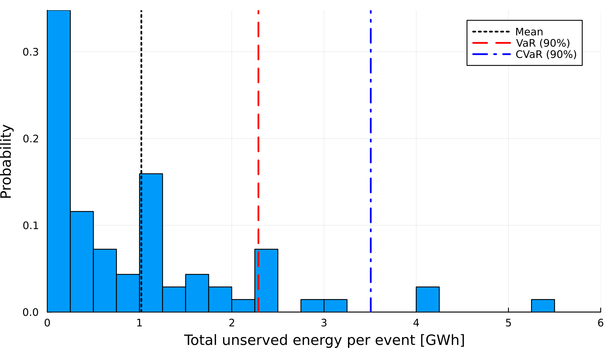

# NEM Reliability Suite
Data and reliability studies for the Australian National Electricity Market (NEM).

This repository contains some sample data, as well as tutorials and scripts to perform reliability studies with [PISP.jl](https://github.com/ARPST-UniMelb/PISP.jl), [PRASNEM.jl](https://github.com/ARPST-UniMelb/PRASNEM.jl) and [SiennaNEM.jl](https://github.com/ARPST-UniMelb/SiennaNEM.jl).

---
## Potential results
The source code to obtain these results can be found in the folder ``/tutorials``.

**Distribution of USE events of the NEM in 2028**

**ISP 2024 Step Change Scenario Adequacy Levels**

**Adequacy in 2030 with/without selected transmission expansion**

